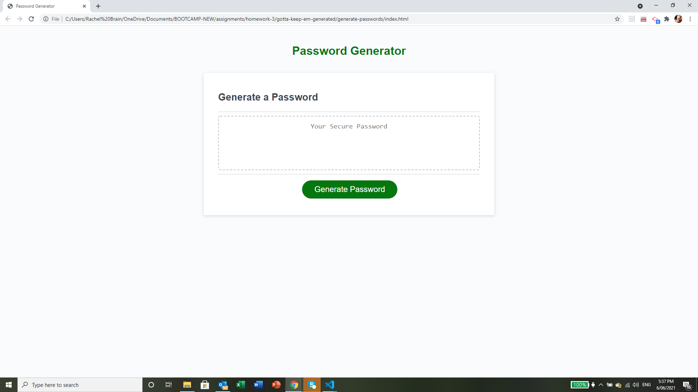

# Random Password Generator
BOOTCAMP - Week 3 assignment


## User Story

```
AS AN employee with access to sensitive data
I WANT to randomly generate a password that meets certain criteria
SO THAT I can create a strong password that provides greater security
```


## Description

My motivation for undertaking this project was to have a simple application enabling me to generate unique & strong passwords.  It was a great exercise to practice basic javascript, such as confirm/prompt/alert windows, methods, functions & iteration.


## Installation

Open the (index.html) page in your prefered browser & click on the green "Generate Password" button.  You will be presented with a series of confirm or prompt windows for password criteria & a required length of password.  Note that you must choose a length between 8 & 128 characters for the generator to run. Once you have answered each question, your unique password is generated & written to the page for you to copy & use, as required.


## Final Appearance

The following image shows the web application's appearance & functionality:




## URLs

* The URL of the deployed application:

    https://rachel-brain.github.io/generate-passwords/

* The URL of the GitHub repository:

    https://github.com/rachel-brain/generate-passwords


## License

No additional License is required as the software copywright is covered by the Trilogy License below.


- - -
© 2021 Trilogy Education Services, LLC, a 2U, Inc. brand. Confidential and Proprietary. All Rights Reserved.